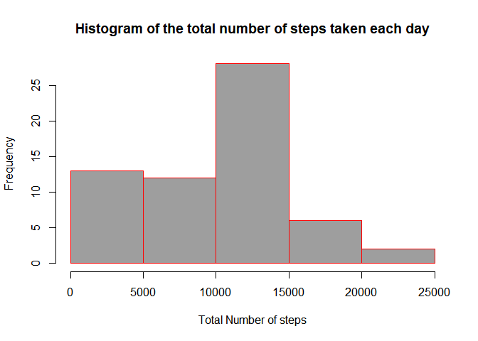
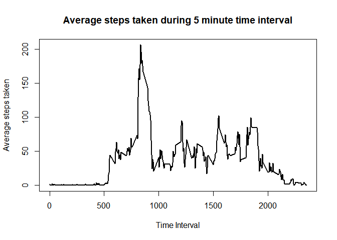
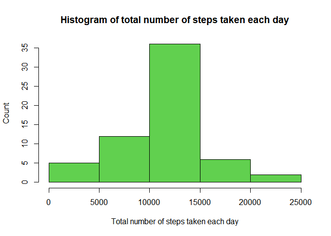
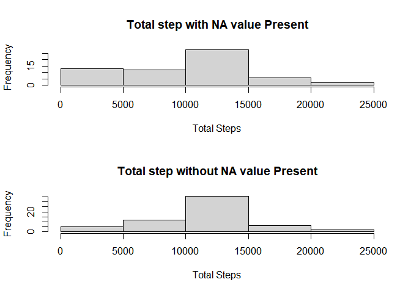
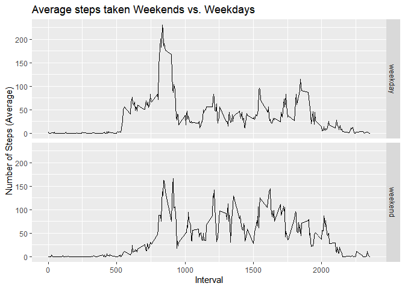

## Loading and preprocessing the data

At first unzipping the original file with unzip() function.  Then read the file using read.csv() function.  


```r
unzip("activity.zip")
activity <- read.csv("activity.csv")
```

Then get a glimps of the data header. Also the structure of the data. 


```r
head(activity)
```

```
##   steps       date interval
## 1    NA 2012-10-01        0
## 2    NA 2012-10-01        5
## 3    NA 2012-10-01       10
## 4    NA 2012-10-01       15
## 5    NA 2012-10-01       20
## 6    NA 2012-10-01       25
```

```r
str(activity)
```

```
## 'data.frame':	17568 obs. of  3 variables:
##  $ steps   : int  NA NA NA NA NA NA NA NA NA NA ...
##  $ date    : chr  "2012-10-01" "2012-10-01" "2012-10-01" "2012-10-01" ...
##  $ interval: int  0 5 10 15 20 25 30 35 40 45 ...
```

As seen from the structure the data set date column is not as Date formatted. So converting the date column as Date formatted.


```r
library(dplyr)
```

```
## 
## Attaching package: 'dplyr'
```

```
## The following objects are masked from 'package:stats':
## 
##     filter, lag
```

```
## The following objects are masked from 'package:base':
## 
##     intersect, setdiff, setequal, union
```

```r
activity <- mutate(activity,date = as.Date(date))
str(activity)
```

```
## 'data.frame':	17568 obs. of  3 variables:
##  $ steps   : int  NA NA NA NA NA NA NA NA NA NA ...
##  $ date    : Date, format: "2012-10-01" "2012-10-01" ...
##  $ interval: int  0 5 10 15 20 25 30 35 40 45 ...
```

## What is mean total number of steps taken per day?

First we have to calculate the total number of steps taken per day.


```r
total <- tapply(activity$steps,activity$date,sum,na.rm=TRUE)
total <- data.frame(Date = names(total),Total.Step = total)
head(total)
```

```
##                  Date Total.Step
## 2012-10-01 2012-10-01          0
## 2012-10-02 2012-10-02        126
## 2012-10-03 2012-10-03      11352
## 2012-10-04 2012-10-04      12116
## 2012-10-05 2012-10-05      13294
## 2012-10-06 2012-10-06      15420
```

As seen from histogram of the total steps taken by each day:


```r
hist(total$Total.Step, xlab="Total Number of steps",ylab="Frequency",col="8",border="red",
     main="Histogram of the total number of steps taken each day")
```




**Mean** and **Median** number of steps taken per day is 9354.2295082 and 10395 respectively. 


## What is the average daily activity pattern?

 We can group data by 5 minute interval and summarize the average for every five minute interval so that we can understand how much activity is occuring every intervals.


```r
averageStep <- activity %>% 
    group_by(interval) %>%
    summarize(avStep = mean(steps,na.rm = TRUE))
```

```
## `summarise()` ungrouping output (override with `.groups` argument)
```

```r
head(averageStep)
```

```
## # A tibble: 6 x 2
##   interval avStep
##      <int>  <dbl>
## 1        0 1.72  
## 2        5 0.340 
## 3       10 0.132 
## 4       15 0.151 
## 5       20 0.0755
## 6       25 2.09
```

Now if we visualise average activity on every 5 minute interval, it looks like:


```r
plot(averageStep$interval, averageStep$avStep, 
     type="l", lwd=2,
     xlab="Time Interval",
     ylab="Average steps taken",
     main="Average steps taken during 5 minute time interval")
```

<!-- -->

We can see the spike has the maximum number of steps for every 5-minute interval.


 
 The spike occur at 835 interval.


## Imputing missing values


Total Number of missing values present in the dataset is: 2304

We can remove these 2304 NA values by different approach. 
The presented approach is that:
* Taking the average steps per interval to their respective missing values.


```r
cleanData <- activity
for (i in 1:nrow(cleanData)) {
    if (is.na(cleanData$steps[i])) {
        # Find the index value for when the interval matches the average
        ndx <- which(cleanData$interval[i] == averageStep$interval)
        # Assign the value to replace the NA
        cleanData$steps[i] <- averageStep[ndx,]$avStep
    }
}
```

As we can see no missing value is presented.

```r
head(cleanData)
```

```
##       steps       date interval
## 1 1.7169811 2012-10-01        0
## 2 0.3396226 2012-10-01        5
## 3 0.1320755 2012-10-01       10
## 4 0.1509434 2012-10-01       15
## 5 0.0754717 2012-10-01       20
## 6 2.0943396 2012-10-01       25
```

```r
str(cleanData)
```

```
## 'data.frame':	17568 obs. of  3 variables:
##  $ steps   : num  1.717 0.3396 0.1321 0.1509 0.0755 ...
##  $ date    : Date, format: "2012-10-01" "2012-10-01" ...
##  $ interval: int  0 5 10 15 20 25 30 35 40 45 ...
```

 As the date column is Date variable. Converting it into Date variable by as.Date() function.
 
 
 ```r
 cleanData$date <- as.Date(cleanData$date)
 str(cleanData)
 ```
 
 ```
 ## 'data.frame':	17568 obs. of  3 variables:
 ##  $ steps   : num  1.717 0.3396 0.1321 0.1509 0.0755 ...
 ##  $ date    : Date, format: "2012-10-01" "2012-10-01" ...
 ##  $ interval: int  0 5 10 15 20 25 30 35 40 45 ...
 ```
We can now group data by date, and summarize the sum of steps taken each day.


```r
stepPerDay <- cleanData %>% 
    group_by(date) %>% 
    summarize(TotalSteps=sum(steps))
```

```
## `summarise()` ungrouping output (override with `.groups` argument)
```

```r
head(stepPerDay)
```

```
## # A tibble: 6 x 2
##   date       TotalSteps
##   <date>          <dbl>
## 1 2012-10-01     10766.
## 2 2012-10-02       126 
## 3 2012-10-03     11352 
## 4 2012-10-04     12116 
## 5 2012-10-05     13294 
## 6 2012-10-06     15420
```

Now a histogram can be plotted to see total steps per day.


```r
hist(stepPerDay$TotalSteps, 
     xlab="Total number of steps taken each day", 
     ylab="Count", 
     main="Histogram of total number of steps taken each day",
     col=3)
```

<!-- -->


**Mean** and **Median** number of steps taken per day is : 1.0766189\times 10^{4} and 1.0766189\times 10^{4} respectively.

As we can see the difference after data imputing is:


```r
meanDiff <- clmeansteps - meanSteps
medianDiff <- clmediansteps - medianSteps
```

Mean difference = 1411.959171
Median difference = 371.1886792

We can see visually the value around zero is decressed after imputing.


```r
par(mfrow=c(2,1))
hist(total$Total.Step,main = "Total step with NA value Present",xlab = "Total Steps")
hist(stepPerDay$TotalSteps,main = "Total step without NA value Present",xlab = "Total Steps")
```

<!-- -->


## Are there differences in activity patterns between weekdays and weekends?

First we make weekday variable


```r
cleanData$day <- weekdays(cleanData$date)
# Define all days as weekdays
cleanData$daytype <- "weekday"
# Fix days that are saturday or sunday to be weekends
cleanData$daytype[cleanData$day %in% c("Saturday", "Sunday")] <- "weekend"
```


Now group data by 5 minute interval and summarize the average number of steps in that interval.


```r
dayaverage <- cleanData %>%
    group_by(daytype, interval) %>%
    summarize(AverageSteps=mean(steps))
```

```
## `summarise()` regrouping output by 'daytype' (override with `.groups` argument)
```

Finally we can visualize how WeedDays and Weekend activities varies.


```r
library(ggplot2)

g<-ggplot(dayaverage,aes(interval,AverageSteps))
g+geom_line()+
      labs(x="Interval",
      y="Number of Steps (Average)",
      title = "Average steps taken Weekends vs. Weekdays")+
      facet_grid(daytype ~.)
```

<!-- -->

